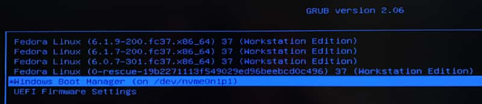

I recently added a spare SSD so I could play with desktop Linux again, and I again quickly grew tired of trying to catch the GRUB boot selection screen. A bit of searching turned up this project log for a [Simplified hardware boot switch](https://hackaday.io/project/179539-hardware-boot-selection-switch/log/196047-simplified-hardware-boot-switch).

The basic idea came together smoothly enough, but I have a few minor additions I thought worth mentioning.

<!-- more -->

In the guide, you detect the presence of the "switch drive" and set the default to the index of the entry you want to boot into.

```sh
search --fs-uuid --set switch_drive C539-84FE
if [ "${switch_drive}" ] ; then
    # Boot Windows
    set default="2"
else
    # Boot Linux
    set default="0"
fi
```

This works great! Until Fedora starts adding alternate/recovery kernel boot options after system updates. This causes the index of the Windows entry to shift down unpredictably.



The first time it happened I just bumped the `set default` up to `"3"`. Then it happened again, and I began searching for a more robust way to select the default.

The context that these GRUB scripts runs in is unfamiliar and not extremely accessible. Most information I found was about how to customize the static config, rather than doing dynamic logic at boot time.

Finally, I stumbled across a promising scrap in an [Ask Ubuntu answer](https://askubuntu.com/a/82965). Apparently one of the ways to set a default (statically) is to set the `GRUB_DEFAULT` variable to the string label of the entry you want to use as the default (their example is `GRUB_DEFAULT="Windows NT/2000/XP (loader) (on /dev/sda1)"`).

So, I wondered, could I also use the string label in my boot time `set default`? The answer turned out to be yes!

So here's the full addition to my `/etc/grub.d/40_custom` file:

```sh
search --label --set switch_drive boot_windows
if [ "${switch_drive}" ] ; then
    set default="Windows Boot Manager (on /dev/nvme0n1p1)"
else
    set default="0"
fi
```

I found the exact string label of the Windows entry with this commend:

```sh
$ sudo fgrep windows /boot/grub2/grub.cfg
menuentry 'Windows Boot Manager (on /dev/nvme0n1p1)' --class windows --class os $menuentry_id_option 'osprober-efi-CE17-A4E0' {
```

Also note that I'm looking up the `switch_drive` by `--label` instead of `--fs-uuid`. It's a minor tweak, but it feels a little less coupled to the specific device.

Finally, wrap it up by generating the GRUB config (this is in Fedora 37):

```
$ sudo grub2-mkconfig -o /boot/grub2/grub.cfg
```

My computer case doesn't lend itself well to direct modding, so I 3D printed a crude enclosure and leave it plugged on the end of a USB extension cable. I should hit a net time savings from this project in about ten years.


